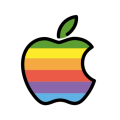

<h1 align="center">Hi 👋, I'm Jose</h1>
<h3 align="center">A passionate Fullstack Developer from Mexico.</h3>

- 🌱 I’m currently learning **Javascript along with NodeJs**

- 💬 Ask me about **Science topics, software topics, books, and anything in general.**

<h3 align="left">Connect with me:</h3>

Email: joslo2345contact@gmail.com 
LinkedIn: <a href="https://www.linkedin.com/in/jose-lopez-81a729122/">Jose Lopez</a>

<h3 align="left">Programming Languages:</h3>

<h3>FrontEnd stack:</h3>

<h3>BackEnd stack:</h3>

<h3>Testing:</h3>

<h3>Cloud:</h3>

<h3>Software:</h3>

<h3>OS:</h3>

<h3>Certifications:</h3>

From freeCodeCamp: 
<strong>Responsive Web Design.</strong> 
<strong>JavaScript Algorithms and Data Structures.</strong>

<!--
**joslo2345/joslo2345** is a ✨ _special_ ✨ repository because its `README.md` (this file) appears on your GitHub profile.

Here are some ideas to get you started:

- 🔭 I’m currently working on ...
- 🌱 I’m currently learning ...
- 👯 I’m looking to collaborate on ...
- 🤔 I’m looking for help with ...
- 💬 Ask me about ...
- 📫 How to reach me: ...
- 😄 Pronouns: ...
- ⚡ Fun fact: ...
-->
